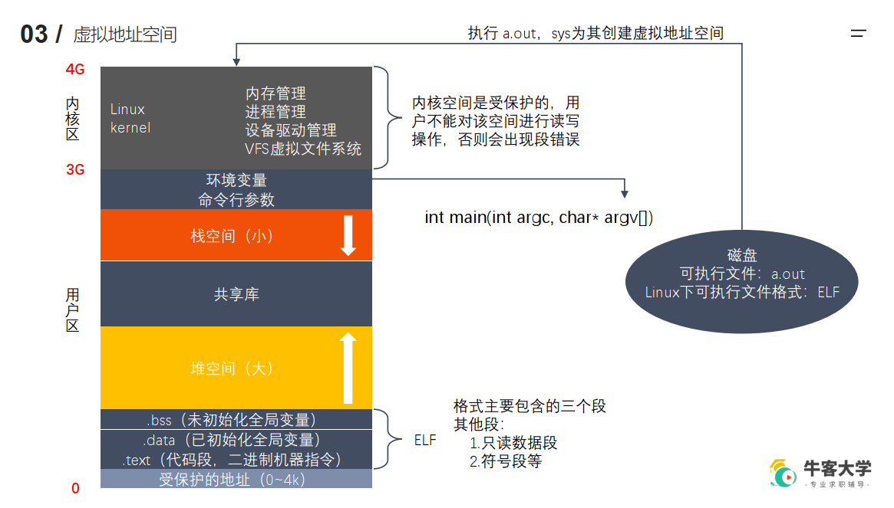

# 虚拟地址空间
实际上是不存在的，是为了解决程序加载内存问题和模型问题的概念。每个进程都有这样一个空间。CPU通过MMU将虚拟地址空间映射到真实的物理内存空间中。
## 虚拟地址空间的组成
### 用户区
在32位系统中，理论的虚拟地址空间为4G，其中
|受保护的地址|.bss|堆|栈|
|-------|----|---|----|
|NULL和nullptr在此|未初始化和初始化为0的全局和静态变量都在此|new和malloc出来的数据，比栈大，从低位到高位|比堆小，从高位到低位|

### 内核区
系统调用--调用Linux系统API