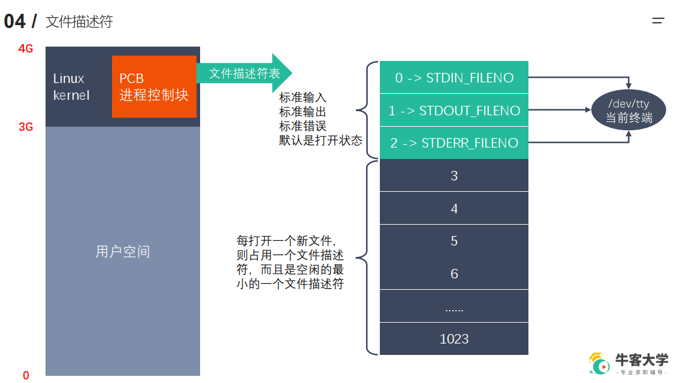

# 文件描述符
## 进程和程序的区别
一个程度或是可执行文件只是一个文件，而当其运行起来，系统分配资源给它，那它和这些资源就可以合称为进程，就是一个正在运行的程序。
## 文件描述符

其中的文件描述符表是一个数组(因为一个进程中打开的文件有可能不止一个，因此需要数组的结构来存储他们的地址),数组大小默认为1024,最大同时打开的文件数量为1024。  
数组的前三个位置为图中所示，对应的是当前的终端，其值是固定的，通过他们就能找到绑定的设备终端。  
同一个文件我们可以使用fopen多次打开，其返回的文件描述符其实是不一样的，被占用的文件描述符被释放后才可以被重新使用。
每次打开一个新的文件，PCB都会在文件描述符表里找到一个没有被占用的最小的文件描述符来使用。