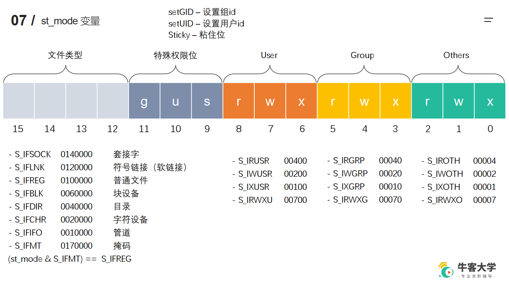

# Linux系统IO函数
## open
int open(const char *pathname,int flags);  
int open(const char *pathname,int flags,mode_t mode);
## read/write
## lseek
## stat/lstat
```
struct stat {
dev_t st_dev; // 文件的设备编号
ino_t st_ino; // 节点
mode_t st_mode; // 文件的类型和存取的权限
nlink_t st_nlink; // 连到该文件的硬连接数目
uid_t st_uid; // 用户ID
gid_t st_gid; // 组ID
dev_t st_rdev; // 设备文件的设备编号
off_t st_size; // 文件字节数(文件大小)
blksize_t st_blksize; // 块大小
blkcnt_t st_blocks; // 块数
time_t st_atime; // 最后一次访问时间
time_t st_mtime; // 最后一次修改时间
time_t st_ctime; // 最后一次改变时间(指属性)
};
```
