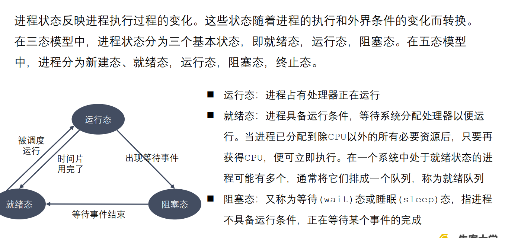
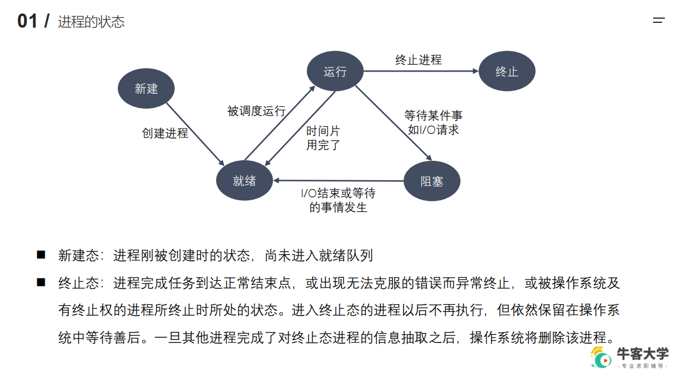

# 进程的状态


## 进程相关命令
```
◼ 查看进程
    ps aux / ajx
        a：显示终端上的所有进程，包括其他用户的进程
        u：显示进程的详细信息
        x：显示没有控制终端的进程
        j：列出与作业控制相关的信息
◼ STAT参数意义：
    D 不可中断 Uninterruptible（usually IO）
    R 正在运行，或在队列中的进程
    S(大写) 处于休眠状态
    T 停止或被追踪
    Z 僵尸进程
    W 进入内存交换（从内核2.6开始无效）
    X 死掉的进程
    < 高优先级
    N 低优先级
    s 包含子进程
    + 位于前台的进程组
◼ 实时显示进程动态
    top
    可以在使用 top 命令时加上 -d 来指定显示信息更新的时间间隔，在 top 命令执行后，可以按以下按键对显示的结果进行排序：
        ⚫ M 根据内存使用量排序
        ⚫ P 根据 CPU 占有率排序
        ⚫ T 根据进程运行时间长短排序
        ⚫ U 根据用户名来筛选进程
        ⚫ K 输入指定的 PID 杀死进程

◼ 杀死进程
    kill [-signal] pid
    kill –l 列出所有信号
    kill –SIGKILL 进程ID
    kill -9 进程ID
    killall name 根据进程名杀死进程
```
## 进程号和相关函数
```
◼ 每个进程都由进程号来标识，其类型为 pid_t（整型），进程号的范围： 0～ 32767。
进程号总是唯一的，但可以重用。当一个进程终止后，其进程号就可以再次使用。
◼ 任何进程（除 init 进程）都是由另一个进程创建，该进程称为被创建进程的父进程，
对应的进程号称为父进程号（PPID）。
◼ 进程组是一个或多个进程的集合。他们之间相互关联，进程组可以接收同一终端的各
种信号，关联的进程有一个进程组号（PGID）。默认情况下，当前的进程号会当做当
前的进程组号。
◼ 进程号和进程组相关函数：
    ⚫ pid_t getpid(void);
    ⚫ pid_t getppid(void);
    ⚫ pid_t getpgid(pid_t pid);
```