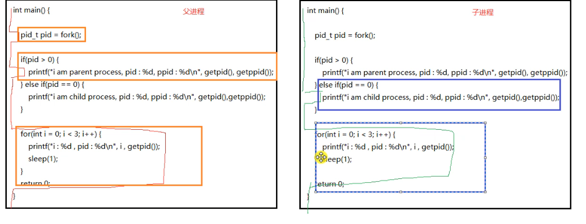
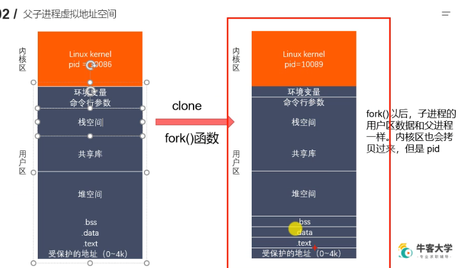
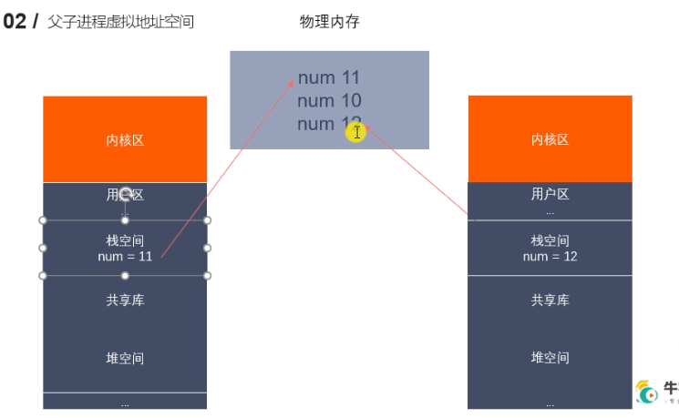

# 进程的创建
## 子进程和父进程的关系

  
如图所示，fork之后子进程会clone一份父进程的虚拟地址空间，其用户数据和父进程一样，内核区也会拷贝过来，但是其pid不一样。  
需要注意的是，上面所说的pid是指进程号，而fork返回的pid其实是在栈空间内的一个局部变量，在父进程中的该局部变量值是子进程的pid，而在子进程中，栈空间内的这个局部变量的值为0。这个需要注意，因此我们可以说，用户区数据除了这个fork的返回值不一样外都一样，内核区除了进程号外都一样。  
因此，我们如果想要对父子进程做以区分，就需要用fork的返回值来做条件，如果没有用该条件限制的代码父子进程都会去执行。(当然这里子进程能够执行的只能是fork以后的代码，都没创建子进程的代码当然让子进程去执行了。存疑)
父进程和子进程内的其余变量值是一样的，但是他们在不同的内存空间内，修改其中的一个不会影响另一个。
```
读时共享--写时复制
实际上，更准确地说，linux中的fork()使用是通过写时拷贝(copy on write)实现
写时拷贝时一种可以推迟甚至避免拷贝数据的技术
内核此时并不复制整个进程的地址空间，而是让父子进程共享同一个地址空间
只用在需要写入的时候才会复制地址空间，从而使各个进程拥有各自的地址空间。
也就是说，资源的复制时需要写入的时候才会进行，再次之前，只有以只读方式共享。
注意：fork之后父子进程共享文件
fork产生的子进程和父进程相同的文件描述符指向相同的文件表，引用计数增加
```

如上图所示，fork之后，其实没有真正的拷贝父进程的虚拟地址空间，只是他们的指向是相同的，那在子进程读变量的时候，就可以避免创建内存空间，占用更多的系统资源，
如图所示，一开始两者的变量num都指向内存中的num10，而在父进程修改num值后，父进程的num指向了新的num11，而子进程仍然指向num10，当子进程也修改num时，子进程的num指向了num12，也就是他们在写操作时，才会真正的复制原来的内存空间进行操作。