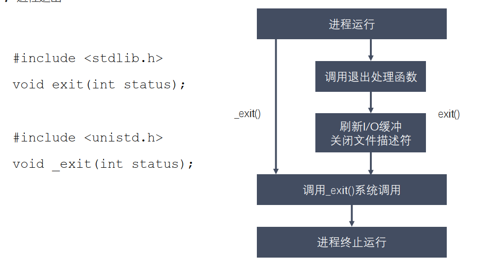

# 进程控制
## 进程退出
  
printf("\n")中如果添加了\n，则会刷新I/O缓冲，如果没有添加，而是用标准C库的exit()，则会自动刷新缓冲区输出没有\n的字符串。而如果使用unix的_exit()函数退出，则不会自动刷新缓冲区，不会输出没有\n的字符串。
## 孤儿进程
```
◼ 父进程运行结束，但子进程还在运行（未运行结束），这样的子进程就称为孤儿进程
（Orphan Process）。
◼ 每当出现一个孤儿进程的时候，内核就把孤儿进程的父进程设置为 init(pid=1) ，而 init
进程会循环地 wait() 它的已经退出的子进程。这样，当一个孤儿进程凄凉地结束
了其生命周期的时候， init 进程就会代表党和政府出面处理它的一切善后工作。
◼ 因此孤儿进程并不会有什么危害。
```
## 僵尸进程
```
◼ 每个进程结束之后, 都会释放自己地址空间中的用户区数据，内核区的 PCB 没有办法
自己释放掉，需要父进程去释放。
◼ 进程终止时，父进程尚未回收，子进程残留资源（PCB）存放于内核中，变成僵尸
（Zombie）进程。
◼ 僵尸进程不能被 kill -9 杀死，这样就会导致一个问题，如果父进程不调用 wait()
或 waitpid() 的话，那么保留的那段信息就不会释放，其进程号就会一直被占用，
但是系统所能使用的进程号是有限的，如果大量的产生僵尸进程，将因为没有可用的进
程号而导致系统不能产生新的进程，此即为僵尸进程的危害，应当避免。
```