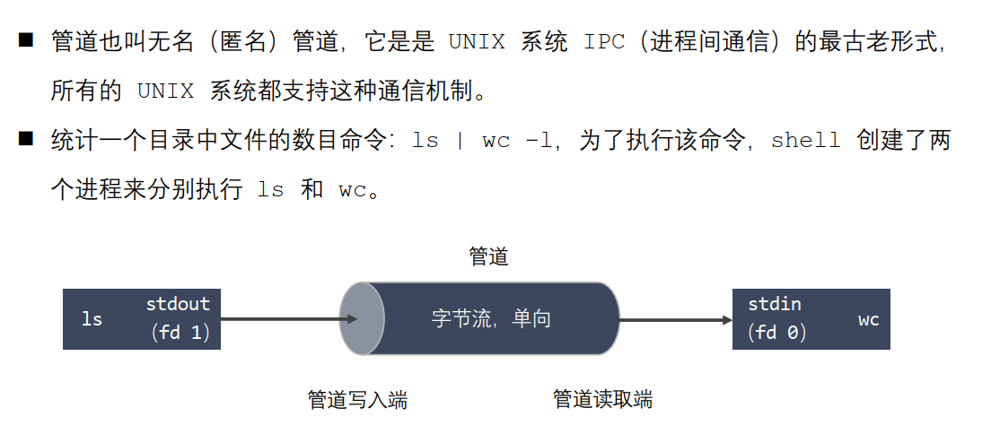

# 进程间通信
## 概念
```
◼ 进程是一个独立的资源分配单元，不同进程（这里所说的进程通常指的是用户进程）之间
的资源是独立的，没有关联，不能在一个进程中直接访问另一个进程的资源。
◼ 但是，进程不是孤立的，不同的进程需要进行信息的交互和状态的传递等，因此需要进程
间通信( IPC：Inter Processes Communication )。
◼ 进程间通信的目的：
◼ 数据传输：一个进程需要将它的数据发送给另一个进程。
◼ 通知事件：一个进程需要向另一个或一组进程发送消息，通知它（它们）发生了某种
事件（如进程终止时要通知父进程）。
◼ 资源共享：多个进程之间共享同样的资源。为了做到这一点，需要内核提供互斥和同
步机制。
◼ 进程控制：有些进程希望完全控制另一个进程的执行（如 Debug 进程），此时控制
进程希望能够拦截另一个进程的所有陷入和异常，并能够及时知道它的状态改变。
```

## 通信方式


### 匿名管道

##### 管道的特点
```
◼ 管道其实是一个在内核内存中维护的缓冲器，这个缓冲器的存储能力是有限的，不同的
操作系统大小不一定相同。
◼ 管道拥有文件的特质：读操作、写操作，匿名管道没有文件实体，有名管道有文件实体，
但不存储数据。可以按照操作文件的方式对管道进行操作。
◼ 一个管道是一个字节流，使用管道时不存在消息或者消息边界的概念，从管道读取数据
的进程可以读取任意大小的数据块，而不管写入进程写入管道的数据块的大小是多少。
◼ 通过管道传递的数据是顺序的，从管道中读取出来的字节的顺序和它们被写入管道的顺
序是完全一样的。
```

##### 为什么匿名管道可以进行有关系的进程的通信
  
总的来说，就是因为fork出来的进程的文件描述符列表是共享的
##### 管道的数据结构
  
这种数据结构可以利用已经读完的内存空间重新写入，提高内存利用率
##### 匿名管道的使用
```
◼ 创建匿名管道
#include <unistd.h>
int pipe(int pipefd[2]);
◼ 查看管道缓冲大小命令
ulimit –a
◼ 查看管道缓冲大小函数
#include <unistd.h>
long fpathconf(int fd, int name);
```
##### 匿名管道读写的情况
