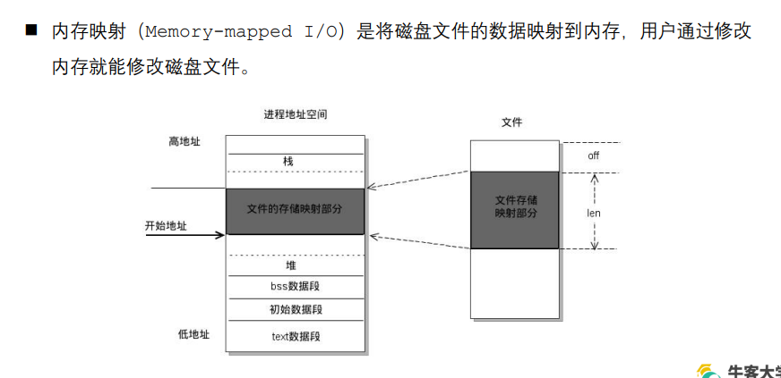

# 内存映射
效率较高
  
## 系统调用
```
◼ #include <sys/mman.h>
◼ void *mmap(void *addr, size_t length, int prot, int flags,int fd, off_t offset);
◼ int munmap(void *addr, size_t length);
```
## 注意事项
1. 如果对mmap得返回值(ptr)做++操作，mumap能否成功？
```
void* ptr = mmap(...);
ptr++;
munmap(ptr,len); //错误，要保存地址
```
2. 如果open时O_RDONLY,mmap时prot参数指定PROT_READ|PROT_WRITE会怎么样？
```
open函数中得权限建议和prot参数的权限保持一致(prot<open)
```
3. 如果文件偏移量为1000会怎样？
```
偏移量必须是4K得整数倍，返回MAP_FAILED
```
4. mmap什么情况下会调用失败？
```
    第二个参数:length=0
    第三个参数:prot
        - 只指定了写权限
        - prot PROT_READ | PROT_WRITE
            第五个参数fd通过open函数时指定的O_RDONLY/O_WRONLY
```
5. 可以open得时候O_CREAT一个新文件来创建映射区嘛？
```
    -可以的，但是创建的文件的大小如果为0的话，肯定不行
    -可以对新的文件进行拓展
        - lseek()
        - truncate()
```
6. mmap后关闭文件描述符，对mmap映射有没有影响？
```
int fd = open("xxx");
mmap(,,,fd,0);
close(fd);
//映射区仍然存在，创建映射区的fd被关闭，没有任何影响
```
7. 对ptr越界操作会怎么样？
```
void * ptr = mmap(NULL,100,,,,);
越界操作操作的是非法的内存->段错误
```
