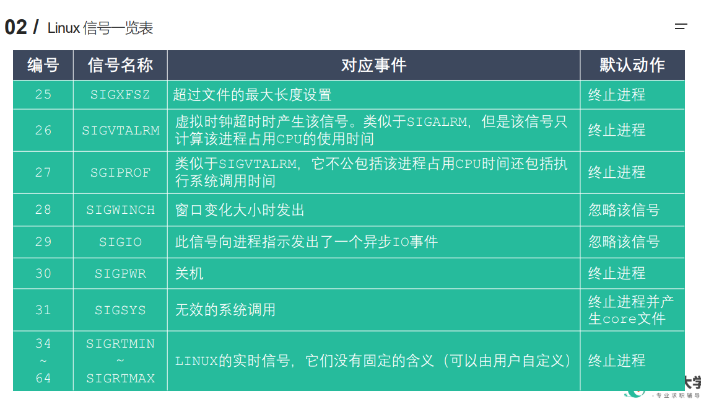

# 信号
## 简介
```C++
◼ 信号是 Linux 进程间通信的最古老的方式之一，是事件发生时对进程的通知机制，有时也
称之为软件中断，它是在软件层次上对中断机制的一种模拟，是一种异步通信的方式。信号
可以导致一个正在运行的进程被另一个正在运行的异步进程中断，转而处理某一个突发事件。
◼ 发往进程的诸多信号，通常都是源于内核。引发内核为进程产生信号的各类事件如下：
     对于前台进程，用户可以通过输入特殊的终端字符来给它发送信号。比如输入Ctrl+C通常会给进程发送一个中断信号。
     硬件发生异常，即硬件检测到一个错误条件并通知内核，随即再由内核发送相应信号给相关进程。比如执行一条异常的机器语言指令，诸如被 0 除，或者引用了无法访问的内存区域。
     系统状态变化，比如 alarm 定时器到期将引起 SIGALRM 信号，进程执行的 CPU时间超限，或者该进程的某个子进程退出。
     运行 kill 命令或调用 kill 函数。
◼ 使用信号的两个主要目的是：
     让进程知道已经发生了一个特定的事情。
     强迫进程执行它自己代码中的信号处理程序。
◼ 信号的特点：
     简单
     不能携带大量信息
     满足某个特定条件才发送
     优先级比较高
◼ 查看系统定义的信号列表：kill –l 
◼ 前 31 个信号为常规信号，其余为实时信号
```
## 信号一览



