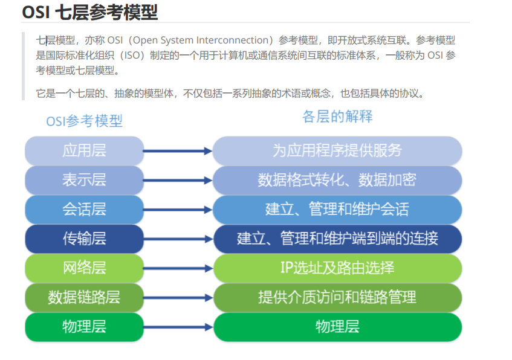
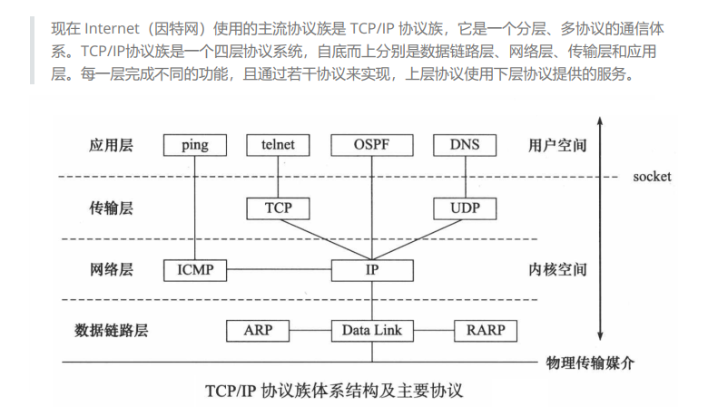
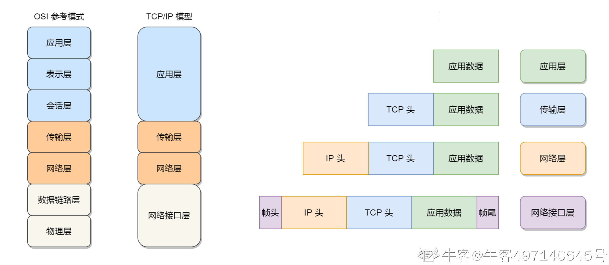
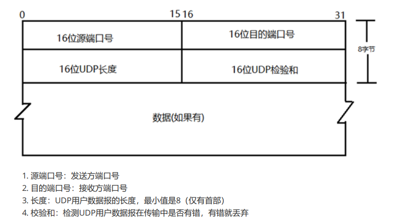

# 基础
## IP协议长度4个字节(255.255.255.255)，MAC协议长度6个字节(ff:ff:ff:ff:ff:ff)
## 网络架构
### C/S结构
```
服务器 - 客户机，即 Client - Server（C/S）结构。C/S 结构通常采取两层结构。服务器负责数据的
管理，客户机负责完成与用户的交互任务。客户机是因特网上访问别人信息的机器，服务器则是提
供信息供人访问的计算机。
客户机通过局域网与服务器相连，接受用户的请求，并通过网络向服务器提出请求，对数据库进行
操作。服务器接受客户机的请求，将数据提交给客户机，客户机将数据进行计算并将结果呈现给用
户。服务器还要提供完善安全保护及对数据完整性的处理等操作，并允许多个客户机同时访问服务
器，这就对服务器的硬件处理数据能力提出了很高的要求。
在C/S结构中，应用程序分为两部分：服务器部分和客户机部分。服务器部分是多个用户共享的信
息与功能，执行后台服务，如控制共享数据库的操作等；客户机部分为用户所专有，负责执行前台
功能，在出错提示、在线帮助等方面都有强大的功能，并且可以在子程序间自由切换。
```
#### 优点
1. 能充分发挥客户端 PC 的处理能力，很多工作可以在客户端处理后再提交给服务器，所以 C/S 结构
客户端响应速度快；
2. 操作界面漂亮、形式多样，可以充分满足客户自身的个性化要求；
3. C/S 结构的管理信息系统具有较强的事务处理能力，能实现复杂的业务流程；
4. 安全性较高，C/S 一般面向相对固定的用户群，程序更加注重流程，它可以对权限进行多层次校
验，提供了更安全的存取模式，对信息安全的控制能力很强，一般高度机密的信息系统采用 C/S 结
构适宜。
#### 缺点
1. 客户端需要安装专用的客户端软件。首先涉及到安装的工作量，其次任何一台电脑出问题，如病
毒、硬件损坏，都需要进行安装或维护。系统软件升级时，每一台客户机需要重新安装，其维护和
升级成本非常高；
2. 对客户端的操作系统一般也会有限制，不能够跨平台。
### B/S结构
```
B/S 结构（Browser/Server，浏览器/服务器模式），是 WEB 兴起后的一种网络结构模式，WEB
浏览器是客户端最主要的应用软件。这种模式统一了客户端，将系统功能实现的核心部分集中到服
务器上，简化了系统的开发、维护和使用。客户机上只要安装一个浏览器，如 Firefox 或 Internet
Explorer，服务器安装 SQL Server、Oracle、MySQL 等数据库。浏览器通过 Web Server 同数据
库进行数据交互。
```
#### 优点
```
B/S 架构最大的优点是总体拥有成本低、维护方便、 分布性强、开发简单，可以不用安装任何专门的软
件就能实现在任何地方进行操作，客户端零维护，系统的扩展非常容易，只要有一台能上网的电脑就能
使用。
```
#### 缺点
```
1. 通信开销大、系统和数据的安全性较难保障;
2. 个性特点明显降低，无法实现具有个性化的功能要求；
3. 协议一般是固定的：http/https
4. 客户端服务器端的交互是请求-响应模式，通常动态刷新页面，响应速度明显降低。
```
## MAC地址
```
网卡是一块被设计用来允许计算机在计算机网络上进行通讯的计算机硬件，又称为网络适配器或网
络接口卡NIC。其拥有 MAC 地址，属于 OSI 模型的第 2 层，它使得用户可以通过电缆或无线相互
连接。每一个网卡都有一个被称为 MAC 地址的独一无二的 48 位串行号。网卡的主要功能：
1.数据的封装与解封装、
2.链路管理、
3.数据编码与译码
MAC 地址（Media Access Control Address），直译为媒体存取控制位址，也称为局域网地址、
以太网地址、物理地址或硬件地址，它是一个用来确认网络设备位置的位址，由网络设备制造商生
产时烧录在网卡中。在 OSI 模型中，第三层网络层负责 IP 地址，第二层数据链路层则负责 MAC
位址 。MAC 地址用于在网络中唯一标识一个网卡，一台设备若有一或多个网卡，则每个网卡都需
要并会有一个唯一的 MAC 地址。
MAC 地址的长度为 48 位（6个字节），通常表示为 12 个 16 进制数，如：00-16-EA-AE-3C-40 就
是一个MAC 地址，其中前 3 个字节，16 进制数 00-16-EA 代表网络硬件制造商的编号，它由
IEEE（电气与电子工程师协会）分配，而后 3 个字节，16进制数 AE-3C-40 代表该制造商所制造的
某个网络产品（如网卡）的系列号。只要不更改自己的 MAC 地址，MAC 地址在世界是唯一的。
形象地说，MAC 地址就如同身份证上的身份证号码，具有唯一性
```
## IP地址
```
IP 协议是为计算机网络相互连接进行通信而设计的协议。在因特网中，它是能使连接到网上的所
有计算机网络实现相互通信的一套规则，规定了计算机在因特网上进行通信时应当遵守的规则。任
何厂家生产的计算机系统，只要遵守 IP 协议就可以与因特网互连互通。各个厂家生产的网络系统
和设备，如以太网、分组交换网等，它们相互之间不能互通，不能互通的主要原因是因为它们所传
送数据的基本单元（技术上称之为“帧”）的格式不同。IP 协议实际上是一套由软件程序组成的协议
软件，它把各种不同“帧”统一转换成“IP 数据报”格式，这种转换是因特网的一个最重要的特点，使
所有各种计算机都能在因特网上实现互通，即具有“开放性”的特点。正是因为有了 IP 协议，因特
网才得以迅速发展成为世界上最大的、开放的计算机通信网络。因此，IP 协议也可以叫做“因特网
协议”。
IP 地址（Internet Protocol Address）是指互联网协议地址，又译为网际协议地址。IP 地址是 IP
协议提供的一种统一的地址格式，它为互联网上的每一个网络和每一台主机分配一个逻辑地址，以
此来屏蔽物理地址的差异。
IP 地址是一个 32 位的二进制数，通常被分割为 4 个“ 8 位二进制数”（也就是 4 个字节）。IP 地址
通常用“点分十进制”表示成（a.b.c.d）的形式，其中，a,b,c,d都是 0~255 之间的十进制整数。
例：点分十进IP地址（100.4.5.6），实际上是 32 位二进制数
（01100100.00000100.00000101.00000110）。
```
```
最初设计互联网络时，为了便于寻址以及层次化构造网络，每个 IP 地址包括两个标识码（ID），即网络
ID 和主机 ID。同一个物理网络上的所有主机都使用同一个网络 ID，网络上的一个主机（包括网络上工
作站，服务器和路由器等）有一个主机 ID 与其对应。Internet 委员会定义了 5 种 IP 地址类型以适合不
同容量的网络，即 A 类~ E 类。
其中 A、B、C 3类（如下表格）由 InternetNIC 在全球范围内统一分配，D、E 类为特殊地址。
A类IP地址
一个 A 类 IP 地址是指， 在 IP 地址的四段号码中，第一段号码为网络号码，剩下的三段号码为本地计算
机的号码。如果用二进制表示 IP 地址的话，A 类 IP 地址就由 1 字节的网络地址和 3 字节主机地址组
成，网络地址的最高位必须是“0”。A 类 IP 地址中网络的标识长度为 8 位，主机标识的长度为 24 位，A
类网络地址数量较少，有 126 个网络，每个网络可以容纳主机数达 1600 多万台。
A 类 IP 地址 地址范围 1.0.0.1 - 126.255.255.254（二进制表示为：00000001 00000000 00000000
00000001 - 01111111 11111111 11111111 11111110）。最后一个是广播地址。
A 类 IP 地址的子网掩码为 255.0.0.0，每个网络支持的最大主机数为 256 的 3 次方 - 2 = 16777214 台。B类IP地址
一个 B 类 IP 地址是指，在 IP 地址的四段号码中，前两段号码为网络号码。如果用二进制表示 IP 地址的
话，B 类 IP 地址就由 2 字节的网络地址和 2 字节主机地址组成，网络地址的最高位必须是“10”。B 类 IP
地址中网络的标识长度为 16 位，主机标识的长度为 16 位，B 类网络地址适用于中等规模的网络，有
16384 个网络，每个网络所能容纳的计算机数为 6 万多台。
B 类 IP 地址地址范围 128.0.0.1 - 191.255.255.254 （二进制表示为：10000000 00000000 00000000
00000001 - 10111111 11111111 11111111 11111110）。 最后一个是广播地址。
B 类 IP 地址的子网掩码为 255.255.0.0，每个网络支持的最大主机数为 256 的 2 次方 - 2 = 65534 台。
C类IP地址
一个 C 类 IP 地址是指，在 IP 地址的四段号码中，前三段号码为网络号码，剩下的一段号码为本地计算
机的号码。如果用二进制表示 IP 地址的话，C 类 IP 地址就由 3 字节的网络地址和 1 字节主机地址组
成，网络地址的最高位必须是“110”。C 类 IP 地址中网络的标识长度为 24 位，主机标识的长度为 8 位，
C 类网络地址数量较多，有 209 万余个网络。适用于小规模的局域网络，每个网络最多只能包含254台
计算机。
C 类 IP 地址范围 192.0.0.1-223.255.255.254 （二进制表示为: 11000000 00000000 00000000
00000001 - 11011111 11111111 11111111 11111110）。
C类IP地址的子网掩码为 255.255.255.0，每个网络支持的最大主机数为 256 - 2 = 254 台。
D类IP地址
D 类 IP 地址在历史上被叫做多播地址（multicast address），即组播地址。在以太网中，多播地址命
名了一组应该在这个网络中应用接收到一个分组的站点。多播地址的最高位必须是 “1110”，范围从
224.0.0.0 - 239.255.255.255。
特殊的网址
每一个字节都为 0 的地址（ “0.0.0.0” ）对应于当前主机；
IP 地址中的每一个字节都为 1 的 IP 地址（ “255.255.255.255” ）是当前子网的广播地址；
IP 地址中凡是以 “11110” 开头的 E 类 IP 地址都保留用于将来和实验使用。
IP地址中不能以十进制 “127” 作为开头，该类地址中数字 127.0.0.1 到 127.255.255.255 用于回路测
试，如：127.0.0.1可以代表本机IP地址。
```
### 子网掩码
```
子网掩码（subnet mask）又叫网络掩码、地址掩码、子网络遮罩，它是一种用来指明一个 IP 地
址的哪些位标识的是主机所在的子网，以及哪些位标识的是主机的位掩码。子网掩码不能单独存
在，它必须结合 IP 地址一起使用。子网掩码只有一个作用，就是将某个 IP 地址划分成网络地址和
主机地址两部分。
子网掩码是一个 32 位地址，用于屏蔽 IP 地址的一部分以区别网络标识和主机标识，并说明该 IP
地址是在局域网上，还是在广域网上。
```
```
子网掩码是在 IPv4 地址资源紧缺的背景下为了解决 lP 地址分配而产生的虚拟 lP 技术，通过子网掩码将
A、B、C 三类地址划分为若干子网，从而显著提高了 IP 地址的分配效率，有效解决了 IP 地址资源紧张
的局面。另一方面，在企业内网中为了更好地管理网络，网管人员也利用子网掩码的作用，人为地将一
个较大的企业内部网络划分为更多个小规模的子网，再利用三层交换机的路由功能实现子网互联，从而
有效解决了网络广播风暴和网络病毒等诸多网络管理方面的问题。在大多数的网络教科书中，一般都将子网掩码的作用描述为通过逻辑运算，将 IP 地址划分为网络标识
(Net.ID) 和主机标识(Host.ID)，只有网络标识相同的两台主机在无路由的情况下才能相互通信。
根据 RFC950 定义，子网掩码是一个 32 位的 2 进制数， 其对应网络地址的所有位都置为 1，对应于主
机地址的所有位置都为 0。子网掩码告知路由器，地址的哪一部分是网络地址，哪一部分是主机地址，
使路由器正确判断任意 IP 地址是否是本网段的，从而正确地进行路由。网络上，数据从一个地方传到另
外一个地方，是依靠 IP 寻址。从逻辑上来讲，是两步的。第一步，从 IP 中找到所属的网络，好比是去
找这个人是哪个小区的；第二步，再从 IP 中找到主机在这个网络中的位置，好比是在小区里面找到这个
人。
子网掩码的设定必须遵循一定的规则。与二进制 IP 地址相同，子网掩码由 1 和 0 组成，且 1 和 0 分别
连续。子网掩码的长度也是 32 位，左边是网络位，用二进制数字 “1” 表示，1 的数目等于网络位的长
度；右边是主机位，用二进制数字 “0” 表示，0 的数目等于主机位的长度。这样做的目的是为了让掩码
与 IP 地址做按位与运算时用 0 遮住原主机数，而不改变原网络段数字，而且很容易通过 0 的位数确定子
网的主机数（ 2 的主机位数次方 - 2，因为主机号全为 1 时表示该网络广播地址，全为 0 时表示该网络
的网络号，这是两个特殊地址）。通过子网掩码，才能表明一台主机所在的子网与其他子网的关系，使
网络正常工作
ip地址显示为192.168.100.10/22 则表示其子网掩码前面为1得个数为22个，
```
## 端口
```
“端口” 是英文 port 的意译，可以认为是设备与外界通讯交流的出口。端口可分为虚拟端口和物理
端口，其中虚拟端口指计算机内部或交换机路由器内的端口，不可见，是特指TCP/IP协议中的端
口，是逻辑意义上的端口。例如计算机中的 80 端口、21 端口、23 端口等。物理端口又称为接
口，是可见端口，计算机背板的 RJ45 网口，交换机路由器集线器等 RJ45 端口。电话使用 RJ11 插
口也属于物理端口的范畴。
如果把 IP 地址比作一间房子，端口就是出入这间房子的门。真正的房子只有几个门，但是一个 IP
地址的端口可以有 65536（即：2^16）个之多！端口是通过端口号来标记的，端口号只有整数，
范围是从 0 到65535（2^16-1）。
```
### 端口类型
```
1.周知端口（Well Known Ports）
周知端口是众所周知的端口号，也叫知名端口、公认端口或者常用端口，范围从 0 到 1023，它们紧密
绑定于一些特定的服务。例如 80 端口分配给 WWW 服务，21 端口分配给 FTP 服务，23 端口分配给
Telnet服务等等。我们在 IE 的地址栏里输入一个网址的时候是不必指定端口号的，因为在默认情况下
WWW 服务的端口是 “80”。网络服务是可以使用其他端口号的，如果不是默认的端口号则应该在地址栏
上指定端口号，方法是在地址后面加上冒号“:”（半角），再加上端口号。比如使用 “8080” 作为 WWW
服务的端口，则需要在地址栏里输入“网址:8080”。但是有些系统协议使用固定的端口号，它是不能被改
变的，比如 139 端口专门用于 NetBIOS 与 TCP/IP 之间的通信，不能手动改变。
2.注册端口（Registered Ports）
端口号从 1024 到 49151，它们松散地绑定于一些服务，分配给用户进程或应用程序，这些进程主要是
用户选择安装的一些应用程序，而不是已经分配好了公认端口的常用程序。这些端口在没有被服务器资
源占用的时候，可以用用户端动态选用为源端口。
3.动态端口 / 私有端口（Dynamic Ports / Private Ports）
动态端口的范围是从 49152 到 65535。之所以称为动态端口，是因为它一般不固定分配某种服务，而是
动态分配。
```
## 网络模型
### OSI七层参考模型

```
1. 物理层：主要定义物理设备标准，如网线的接口类型、光纤的接口类型、各种传输介质的传输速率
等。它的主要作用是传输比特流（就是由1、0转化为电流强弱来进行传输，到达目的地后再转化为
1、0，也就是我们常说的数模转换与模数转换）。这一层的数据叫做比特。
2. 数据链路层：建立逻辑连接、进行硬件地址寻址、差错校验等功能。定义了如何让格式化数据以帧
为单位进行传输，以及如何让控制对物理介质的访问。将比特组合成字节进而组合成帧，用MAC地
址访问介质。
3. 网络层：进行逻辑地址寻址，在位于不同地理位置的网络中的两个主机系统之间提供连接和路径选
择。Internet的发展使得从世界各站点访问信息的用户数大大增加，而网络层正是管理这种连接的
层。
4. 传输层：定义了一些传输数据的协议和端口号（ WWW 端口 80 等），如：TCP（传输控制协议，
传输效率低，可靠性强，用于传输可靠性要求高，数据量大的数据），UDP（用户数据报协议，与
TCP 特性恰恰相反，用于传输可靠性要求不高，数据量小的数据，如 QQ 聊天数据就是通过这种方
式传输的）。 主要是将从下层接收的数据进行分段和传输，到达目的地址后再进行重组。常常把这
一层数据叫做段。
5. 会话层：通过传输层（端口号：传输端口与接收端口）建立数据传输的通路。主要在你的系统之间
发起会话或者接受会话请求。
6. 表示层：数据的表示、安全、压缩。主要是进行对接收的数据进行解释、加密与解密、压缩与解压
缩等（也就是把计算机能够识别的东西转换成人能够能识别的东西（如图片、声音等）。
7. 应用层：网络服务与最终用户的一个接口。这一层为用户的应用程序（例如电子邮件、文件传输和
终端仿真）提供网络服务。
```
### TCP/IP四层模型

```
TCP/IP 协议在一定程度上参考了 OSI 的体系结构。OSI 模型共有七层，从下到上分别是物理层、数据链
路层、网络层、传输层、会话层、表示层和应用层。但是这显然是有些复杂的，所以在 TCP/IP 协议中，
它们被简化为了四个层次。
（1）应用层、表示层、会话层三个层次提供的服务相差不是很大，所以在 TCP/IP 协议中，它们被合并
为应用层一个层次。
（2）由于传输层和网络层在网络协议中的地位十分重要，所以在 TCP/IP 协议中它们被作为独立的两个
层次。
（3）因为数据链路层和物理层的内容相差不多，所以在 TCP/IP 协议中它们被归并在网络接口层一个层
次里。只有四层体系结构的 TCP/IP 协议，与有七层体系结构的 OSI 相比要简单了不少，也正是这样，
TCP/IP 协议在实际的应用中效率更高，成本更低。
```

```
1. 应用层：应用层是 TCP/IP 协议的第一层，是直接为应用进程提供服务的。
（1）对不同种类的应用程序它们会根据自己的需要来使用应用层的不同协议，邮件传输应用使用
了 SMTP 协议、万维网应用使用了 HTTP 协议、远程登录服务应用使用了有 TELNET 协议。
（2）应用层还能加密、解密、格式化数据。
（3）应用层可以建立或解除与其他节点的联系，这样可以充分节省网络资源。
2. 传输层：作为 TCP/IP 协议的第二层，运输层在整个 TCP/IP 协议中起到了中流砥柱的作用。且在运
输层中， TCP 和 UDP 也同样起到了中流砥柱的作用。
3. 网络层：网络层在 TCP/IP 协议中的位于第三层。在 TCP/IP 协议中网络层可以进行网络连接的建立
和终止以及 IP 地址的寻找等功能。
4. 网络接口层：在 TCP/IP 协议中，网络接口层位于第四层。由于网络接口层兼并了物理层和数据链
路层所以，网络接口层既是传输数据的物理媒介，也可以为网络层提供一条准确无误的线路。
```
## 协议
```
协议，网络协议的简称，网络协议是通信计算机双方必须共同遵从的一组约定。如怎么样建立连
接、怎么样互相识别等。只有遵守这个约定，计算机之间才能相互通信交流。它的三要素是：语
法、语义、时序。
为了使数据在网络上从源到达目的，网络通信的参与方必须遵循相同的规则，这套规则称为协议
（protocol），它最终体现为在网络上传输的数据包的格式。
协议往往分成几个层次进行定义，分层定义是为了使某一层协议的改变不影响其他层次的协议。
```
### 常见协议
```
应用层常见的协议有：FTP协议（File Transfer Protocol 文件传输协议）、HTTP协议（Hyper Text
Transfer Protocol 超文本传输协议）、NFS（Network File System 网络文件系统）。
传输层常见协议有：TCP协议（Transmission Control Protocol 传输控制协议）、UDP协议（User
Datagram Protocol 用户数据报协议）。
网络层常见协议有：IP 协议（Internet Protocol 因特网互联协议）、ICMP 协议（Internet Control
Message Protocol 因特网控制报文协议）、IGMP 协议（Internet Group Management Protocol 因特
网组管理协议）。
网络接口层常见协议有：ARP协议（Address Resolution Protocol 地址解析协议）、RARP协议
（Reverse Address Resolution Protocol 反向地址解析协议）。
```
### UDP协议

```
1. 源端口号：发送方端口号
2. 目的端口号：接收方端口号
3. 长度：UDP用户数据报的长度，最小值是8（仅有首部）
4. 校验和：检测UDP用户数据报在传输中是否有错，有错就丢弃
```
### TCP协议

```
1. 源端口号：发送方端口号
2. 目的端口号：接收方端口号
3. 序列号：本报文段的数据的第一个字节的序号
4. 确认序号：期望收到对方下一个报文段的第一个数据字节的序号
5. 首部长度（数据偏移）：TCP 报文段的数据起始处距离 TCP 报文段的起始处有多远，即首部长
度。单位：32位，即以 4 字节为计算单位
6. 保留：占 6 位，保留为今后使用，目前应置为 0
7. 紧急 URG ：此位置 1 ，表明紧急指针字段有效，它告诉系统此报文段中有紧急数据，应尽快传送
8. 确认 ACK：仅当 ACK=1 时确认号字段才有效，TCP 规定，在连接建立后所有传达的报文段都必须
把 ACK 置1
9. 推送 PSH：当两个应用进程进行交互式的通信时，有时在一端的应用进程希望在键入一个命令后立
即就能够收到对方的响应。在这种情况下，TCP 就可以使用推送（push）操作，这时，发送方
TCP 把 PSH 置 1，并立即创建一个报文段发送出去，接收方收到 PSH = 1 的报文段，就尽快地
（即“推送”向前）交付给接收应用进程，而不再等到整个缓存都填满后再向上交付
10. 复位 RST：用于复位相应的 TCP 连接
11. 同步 SYN：仅在三次握手建立 TCP 连接时有效。当 SYN = 1 而 ACK = 0 时，表明这是一个连接请
求报文段，对方若同意建立连接，则应在相应的报文段中使用 SYN = 1 和 ACK = 1。因此，SYN 置
1 就表示这是一个连接请求或连接接受报文12. 终止 FIN：用来释放一个连接。当 FIN = 1 时，表明此报文段的发送方的数据已经发送完毕，并要
求释放运输连接
13. 窗口：指发送本报文段的一方的接收窗口（而不是自己的发送窗口）
14. 校验和：校验和字段检验的范围包括首部和数据两部分，在计算校验和时需要加上 12 字节的伪头
部
15. 紧急指针：仅在 URG = 1 时才有意义，它指出本报文段中的紧急数据的字节数（紧急数据结束后就
是普通数据），即指出了紧急数据的末尾在报文中的位置，注意：即使窗口为零时也可发送紧急数
据
16. 选项：长度可变，最长可达 40 字节，当没有使用选项时，TCP 首部长度是 20 字节
```
### IP协议

```
1. 版本：IP 协议的版本。通信双方使用过的 IP 协议的版本必须一致，目前最广泛使用的 IP 协议版本
号为 4（即IPv4)
2. 首部长度：单位是 32 位（4 字节）
3. 服务类型：一般不适用，取值为 0
4. 总长度：指首部加上数据的总长度，单位为字节
5. 标识（identification）：IP 软件在存储器中维持一个计数器，每产生一个数据报，计数器就加 1，
并将此值赋给标识字段
6. 标志（flag）：目前只有两位有意义。
标志字段中的最低位记为 MF。MF = 1 即表示后面“还有分片”的数据报。MF = 0 表示这已是若干数
据报片中的最后一个。
标志字段中间的一位记为 DF，意思是“不能分片”，只有当 DF = 0 时才允许分片
7. 片偏移：指出较长的分组在分片后，某片在源分组中的相对位置，也就是说，相对于用户数据段的
起点，该片从何处开始。片偏移以 8 字节为偏移单位。
8. 生存时间：TTL，表明是数据报在网络中的寿命，即为“跳数限制”，由发出数据报的源点设置这个
字段。路由器在转发数据之前就把 TTL 值减一，当 TTL 值减为零时，就丢弃这个数据报。
9. 协议：指出此数据报携带的数据时使用何种协议，以便使目的主机的 IP 层知道应将数据部分上交
给哪个处理过程，常用的 ICMP(1)，IGMP(2)，TCP(6)，UDP(17)，IPv6（41）
10. 首部校验和：只校验数据报的首部，不包括数据部分。
11. 源地址：发送方 IP 地址
12. 目的地址：接收方 IP 地址
```