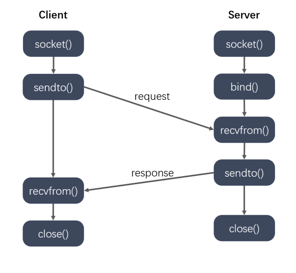
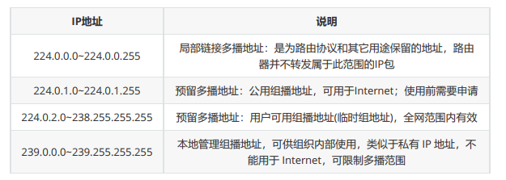

# UDP通讯
## 通讯基础

```
#include <sys/types.h>
#include <sys/socket.h>
ssize_t sendto(int sockfd, const void *buf, size_t len, int flags,const struct sockaddr *dest_addr, socklen_t addrlen);
    - 参数：
        - sockfd : 通信的fd
        - buf : 要发送的数据
        - len : 发送数据的长度
        - flags : 0
        - dest_addr : 通信的另外一端的地址信息
        - addrlen : 地址的内存大小
ssize_t recvfrom(int sockfd, void *buf, size_t len, int flags,struct sockaddr *src_addr, socklen_t *addrlen);
    - 参数：
        - sockfd : 通信的fd
        - buf : 接收数据的数组
        - len : 数组的大小
        - flags : 0
        - src_addr : 用来保存另外一端的地址信息，不需要可以指定为NULL
        - addrlen : 地址的内存大小
```
## 广播
```C
向子网中多台计算机发送消息，并且子网中所有的计算机都可以接收到发送方发送的消息，每个广播消息都包含一个特殊的IP地址，这个IP中子网内主机标志部分的二进制全部为1。
a.只能在局域网中使用。
b.客户端需要绑定服务器广播使用的端口，才可以接收到广播消息。
// 设置广播属性的函数
int setsockopt(int sockfd, int level, int optname,const void *optval, socklen_t optlen);
    - sockfd : 文件描述符
    - level : SOL_SOCKET
    - optname : SO_BROADCAST
    - optval : int类型的值，为1表示允许广播
    - optlen : optval的大小
```
## 组播(多播)
```
单播地址标识单个 IP 接口，广播地址标识某个子网的所有 IP 接口，多播地址标识一组 IP 接口。单播和广播是寻址方案的两个极端（要么单个要么全部），多播则意在两者之间提供一种折中方案。多播数据报只应该由对它感兴趣的接口接收，也就是说由运行相应多播会话应用系统的主机上的接口接收。另外，广播一般局限于局域网内使用，而多播则既可以用于局域网，也可以跨广域网使用。
a.组播既可以用于局域网，也可以用于广域网
b.客户端需要加入多播组，才能接收到多播的数据
```
### 组播地址
```
IP 多播通信必须依赖于 IP 多播地址，在 IPv4 中它的范围从 224.0.0.0 到 239.255.255.255 ，并被划分为局部链接多播地址、预留多播地址和管理权限多播地址三类
```

### 设置组播
```C
int setsockopt(int sockfd, int level, int optname,const void *optval,socklen_t optlen);
// 服务器设置多播的信息，外出接口
    - level : IPPROTO_IP
    - optname : IP_MULTICAST_IF
    - optval : struct in_addr
// 客户端加入到多播组：
    - level : IPPROTO_IP
    - optname : IP_ADD_MEMBERSHIP
    - optval : struct ip_mreq
struct ip_mreq
{
    /* IP multicast address of group. */
    struct in_addr imr_multiaddr; // 组播的IP地址
    /* Local IP address of interface. */
    struct in_addr imr_interface; // 本地的IP地址
};
typedef uint32_t in_addr_t;
struct in_addr
{
    in_addr_t s_addr;
};
```