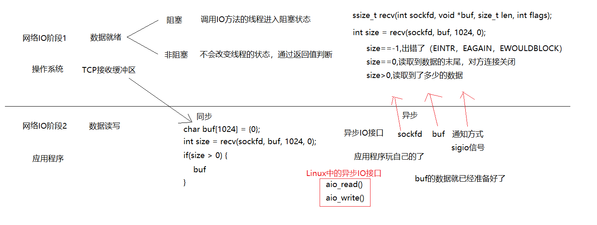
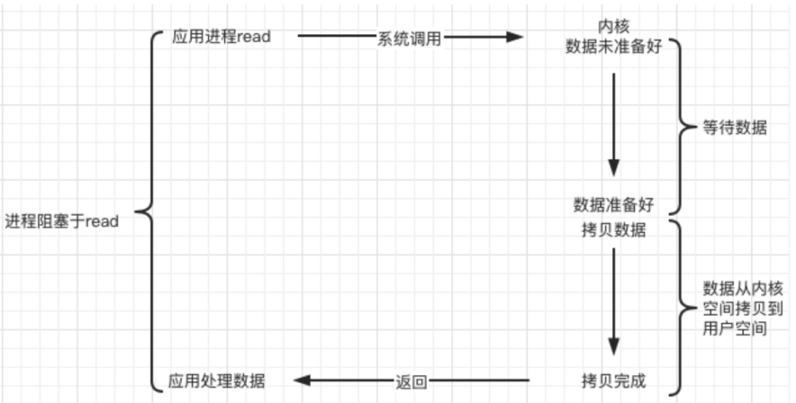
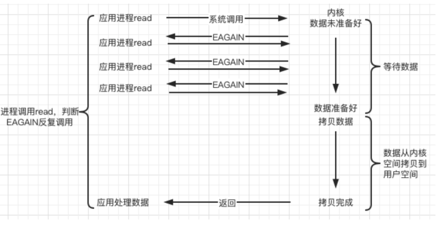
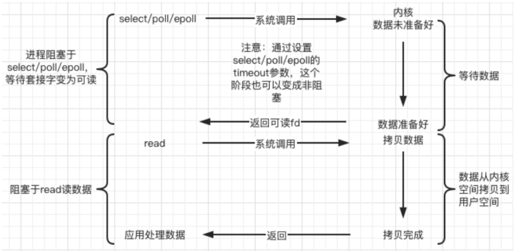
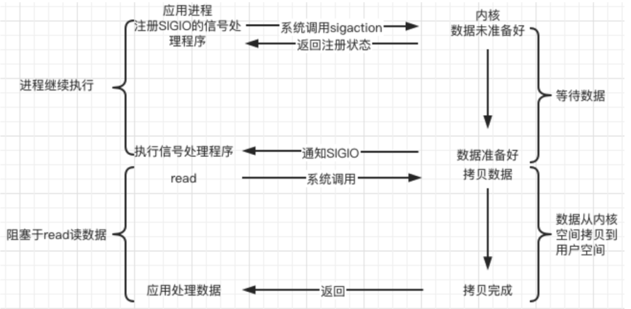
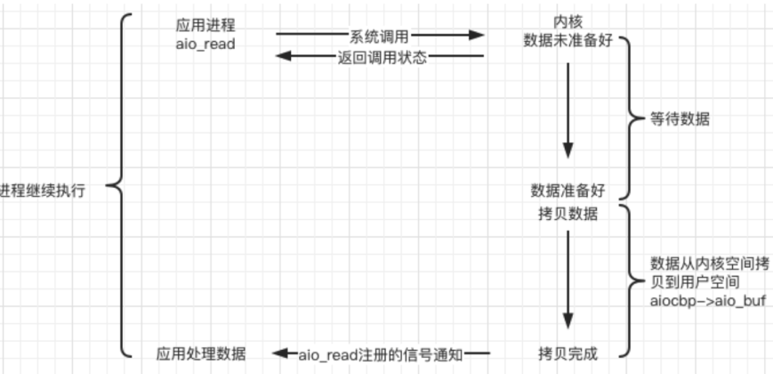

# 阻塞与非阻塞、同步与异步
## IO阶段
```
典型的一次IO的两个阶段是什么？数据就绪 和 数据读写
数据就绪：根据系统IO操作的就绪状态
    阻塞
    非阻塞 使用非阻塞的recv，没有接受到数据则返回-1
            但是如果是因为中断，则返回错误号EINTR,
            如果没有接收到数据，则返回EAGAIN/EWOULDBLOCK，
            否则就是传输出错
数据读写：根据应用程序和内核的交互方式
    同步
    异步
    
陈硕：在处理 IO 的时候，阻塞和非阻塞都是同步 IO，只有使用了特殊的 API 才是异步 IO
```

```
一个典型的网络IO接口调用，分为两个阶段，分别是“数据就绪” 和 “数据读写”，数据就绪阶段分为阻塞和非阻塞，表现得结果就是，阻塞当前线程或是直接返回。

同步表示A向B请求调用一个网络IO接口时（或者调用某个业务逻辑API接口时），数据的读写都是由请求方A自己来完成的（不管是阻塞还是非阻塞）；

异步表示A向B请求调用一个网络IO接口时（或者调用某个业务逻辑API接口时），向B传入请求的事件以及事件发生时通知的方式，A就可以处理其它逻辑了，当B监听到事件处理完成后，会用事先约定好的通知方式，通知A处理结果。
```

# I/O模型
## blocking 阻塞
调用者调用了某个函数，等待这个函数返回，期间什么也不做，不停的去检查这个函数有没有返回，必须等这个函数返回才能进行下一步动作。

## non-blocking 非阻塞
非阻塞等待，每隔一段时间就去检测IO事件是否就绪。没有就绪就可以做其他事。非阻塞I/O执行系统调用总是立即返回，不管事件是否已经发生，若事件没有发生，则返回-1，此时可以根据 errno 区分这两种情况，对于accept，recv 和 send，事件未发生时，errno 通常被设置成 EAGAIN。

## IO复用
```
Linux 用 select/poll/epoll 函数实现 IO 复用模型，这些函数也会使进程阻塞，但是和阻塞IO所不同的是这些函数可以同时阻塞多个IO操作。而且可以同时对多个读操作、写操作的IO函数进行检测。直到有数据可读或可写时，才真正调用IO操作函数。
```

## 信号驱动
```
Linux 用套接口进行信号驱动 IO，安装一个信号处理函数，进程继续运行并不阻塞，当IO事件就绪，进程收SIGIO 信号，然后处理 IO 事件
```

```
内核在第一个阶段是异步，在第二个阶段是同步；与非阻塞IO的区别在于它提供了消息通知机制，不需要用户进程不断的轮询检查，减少了系统API的调用次数，提高了效率。
```
## 异步
```
Linux中，可以调用 aio_read 函数告诉内核描述字缓冲区指针和缓冲区的大小、文件偏移及通知的方式，然后立即返回，当内核将数据拷贝到缓冲区后，再通知应用程序。
```
