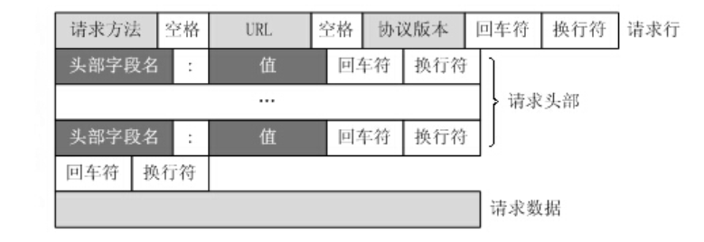
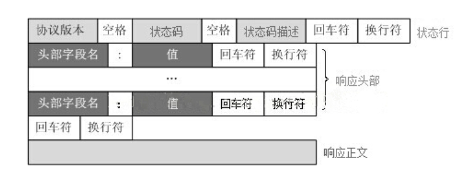

# Web Server
## 简介
一个 Web Server 就是一个服务器软件（程序），或者是运行这个服务器软件的硬件（计算机）。其主要功能是通过 HTTP 协议与客户端（通常是浏览器（Browser））进行通信，来接收，存储，处理来自客户端的 HTTP 请求，并对其请求做出 HTTP 响应，返回给客户端其请求的内容（文件、网页等）或返回一个 Error 信息。

通常用户使用 Web 浏览器与相应服务器进行通信。在浏览器中键入“域名”或“IP地址:端口号”，浏览器则先将你的域名解析成相应的 IP 地址或者直接根据你的IP地址向对应的 Web 服务器发送一个 HTTP 请求。这一过程首先要通过 TCP 协议的三次握手建立与目标 Web 服务器的连接，然后 HTTP 协议生成针对目标 Web 服务器的 HTTP 请求报文，通过 TCP、IP 等协议发送到目标 Web 服务器上。

# HTTP协议(应用层协议)
## 简介
超文本传输协议（Hypertext Transfer Protocol，HTTP）是一个简单的请求 - 响应协议，它通常运行在TCP 之上。它指定了客户端可能发送给服务器什么样的消息以及得到什么样的响应。请求和响应消息的头以 ASCII 形式给出；而消息内容则具有一个类似 MIME 的格式。HTTP是万维网的数据通信的基础。

HTTP的发展是由蒂姆·伯纳斯-李于1989年在欧洲核子研究组织（CERN）所发起。HTTP的标准制定由万维网协会（World Wide Web Consortium，W3C）和互联网工程任务组（Internet Engineering TaskForce，IETF）进行协调，最终发布了一系列的RFC，其中最著名的是1999年6月公布的 RFC 2616，定义了HTTP协议中现今广泛使用的一个版本——HTTP 1.1。
## 概述
HTTP 是一个客户端终端（用户）和服务器端（网站）请求和应答的标准（TCP）。通过使用网页浏览器、网络爬虫或者其它的工具，客户端发起一个HTTP请求到服务器上指定端口（默认端口为80）。我们称这个客户端为用户代理程序（user agent）。应答的服务器上存储着一些资源，比如 HTML 文件和图像。我们称这个应答服务器为源服务器（origin server）。在用户代理和源服务器中间可能存在多个“中间层”，比如代理服务器、网关或者隧道（tunnel）。  
尽管 TCP/IP 协议是互联网上最流行的应用，HTTP 协议中，并没有规定必须使用它或它支持的层。事实上，HTTP可以在任何互联网协议上，或其他网络上实现。HTTP 假定其下层协议提供可靠的传输。因此，任何能够提供这种保证的协议都可以被其使用。因此也就是其在 TCP/IP 协议族使用 TCP 作为其传输层。  
通常，由HTTP客户端发起一个请求，创建一个到服务器指定端口（默认是80端口）的 TCP 连接。HTTP服务器则在那个端口监听客户端的请求。一旦收到请求，服务器会向客户端返回一个状态，比如"HTTP/1.1 200 OK"，以及返回的内容，如请求的文件、错误消息、或者其它信息。
## 工作原理
HTTP 协议定义 Web 客户端如何从 Web 服务器请求 Web 页面，以及服务器如何把 Web 页面传送给客户端。HTTP 协议采用了请求/响应模型。客户端向服务器发送一个请求报文，请求报文包含请求的方法、URL、协议版本、请求头部和请求数据。服务器以一个状态行作为响应，响应的内容包括协议的版本、成功或者错误代码、服务器信息、响应头部和响应数据。
```
以下是 HTTP 请求/响应的步骤：
1. 客户端连接到 Web 服务器
一个HTTP客户端，通常是浏览器，与 Web 服务器的 HTTP 端口（默认为 80 ）建立一个 TCP 套接字连接。例如，http://www.baidu.com。（URL）
2. 发送 HTTP 请求
通过 TCP 套接字，客户端向 Web 服务器发送一个文本的请求报文，一个请求报文由请求行、请求头部、空行和请求数据 4 部分组成。
3. 服务器接受请求并返回 HTTP 响应
Web 服务器解析请求，定位请求资源。服务器将资源复本写到 TCP 套接字，由客户端读取。一个响应由状态行、响应头部、空行和响应数据 4 部分组成。
4. 释放连接 TCP 连接
若 connection 模式为 close，则服务器主动关闭 TCP连接，客户端被动关闭连接，释放 TCP 连接；若connection 模式为 keepalive，则该连接会保持一段时间，在该时间内可以继续接收请求;
5. 客户端浏览器解析 HTML 内容

客户端浏览器首先解析状态行，查看表明请求是否成功的状态代码。然后解析每一个响应头，响应头告知以下为若干字节的 HTML 文档和文档的字符集。客户端浏览器读取响应数据 HTML，根据HTML 的语法对其进行格式化，并在浏览器窗口中显示。
例如：在浏览器地址栏键入URL，按下回车之后会经历以下流程：
1. 浏览器向 DNS 服务器请求解析该 URL 中的域名所对应的 IP 地址;
2. 解析出 IP 地址后，根据该 IP 地址和默认端口 80，和服务器建立 TCP 连接;
3. 浏览器发出读取文件（ URL 中域名后面部分对应的文件）的 HTTP 请求，该请求报文作为 TCP 三次握手的第三个报文的数据发送给服务器;
4. 服务器对浏览器请求作出响应，并把对应的 HTML 文本发送给浏览器;
5. 释放 TCP 连接;
6. 浏览器将该 HTML 文本并显示内容。
```
HTTP 协议是基于 TCP/IP 协议之上的应用层协议，基于 请求-响应 的模式。HTTP 协议规定，请求从客户端发出，最后服务器端响应该请求并返回。换句话说，肯定是先从客户端开始建立通信的，服务器端在没有接收到请求之前不会发送响应。
## HTTP请求报文格式

## HTTP响应报文格式

## HTTP请求方法
```
1. GET：向指定的资源发出“显示”请求。使用 GET 方法应该只用在读取数据，而不应当被用于产生“副作用”的操作中，例如在 Web Application 中。其中一个原因是 GET 可能会被网络蜘蛛等随意访问。
2. HEAD：与 GET 方法一样，都是向服务器发出指定资源的请求。只不过服务器将不传回资源的本文部分。它的好处在于，使用这个方法可以在不必传输全部内容的情况下，就可以获取其中“关于该资源的信息”（元信息或称元数据）。
3. POST：向指定资源提交数据，请求服务器进行处理（例如提交表单或者上传文件）。数据被包含在请求本文中。这个请求可能会创建新的资源或修改现有资源，或二者皆有。
4. PUT：向指定资源位置上传其最新内容。
5. DELETE：请求服务器删除 Request-URI 所标识的资源。
6. TRACE：回显服务器收到的请求，主要用于测试或诊断。
7. OPTIONS：这个方法可使服务器传回该资源所支持的所有 HTTP 请求方法。用'*'来代替资源名称，
向 Web 服务器发送 OPTIONS 请求，可以测试服务器功能是否正常运作。
8. CONNECT：HTTP/1.1 协议中预留给能够将连接改为管道方式的代理服务器。通常用于SSL加密服务器的链接（经由非加密的 HTTP 代理服务器）。
```