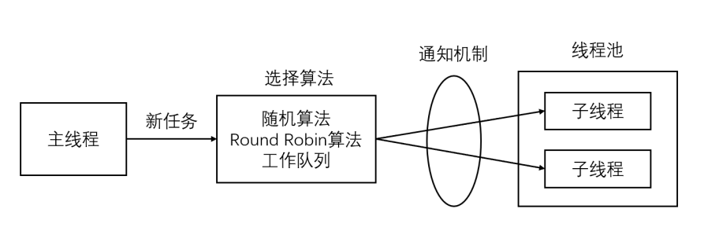

# 线程池
线程池是由服务器预先创建的一组子线程，线程池中的线程数量应该和 CPU 数量差不多。线程池中的所有子线程都运行着相同的代码。当有新的任务到来时，主线程将通过某种方式选择线程池中的某一个子线程来为之服务。相比与动态的创建子线程，选择一个已经存在的子线程的代价显然要小得多。至于主线程选择哪个子线程来为新任务服务，则有多种方式：
* 主线程使用某种算法来主动选择子线程。最简单、最常用的算法是随机算法和 Round Robin（轮流选取）算法，但更优秀、更智能的算法将使任务在各个工作线程中更均匀地分配，从而减轻服务器的整体压力。
* 主线程和所有子线程通过一个共享的工作队列来同步，子线程都睡眠在该工作队列上。当有新的任务到来时，主线程将任务添加到工作队列中。这将唤醒正在等待任务的子线程，不过只有一个子线程将获得新任务的”接管权“，它可以从工作队列中取出任务并执行之，而其他子线程将继续睡眠在工作队列上。
  
线程池的一般模型为：

```
线程池中的线程数量最直接的限制因素是中央处理器(CPU)的处理器(processors/cores)的数量N ：如果你的CPU是4-cores的，对于CPU密集型的任务(如视频剪辑等消耗CPU计算资源的任务)来说，那线程池中的线程数量最好也设置为4（或者+1防止其他因素造成的线程阻塞）；对于IO密集型的任务，一般要多于CPU的核数，因为线程间竞争的不是CPU的计算资源而是IO，IO的处理一般较慢，多于cores数的线程将为CPU争取更多的任务，不至在线程处理IO的过程造成CPU空闲导致资源浪费。
```
* 空间换时间，浪费服务器的硬件资源，换取运行效率。
* 池是一组资源的集合，这组资源在服务器启动之初就被完全创建好并初始化，这称为静态资源。
* 当服务器进入正式运行阶段，开始处理客户请求的时候，如果它需要相关的资源，可以直接从池中获取，无需动态分配。
* 当服务器处理完一个客户连接后，可以把相关的资源放回池中，无需执行系统调用释放资源。