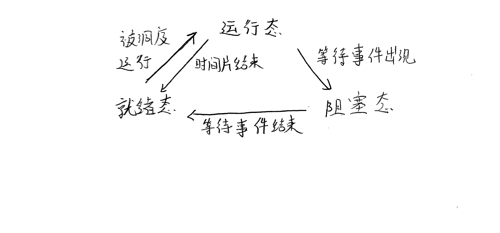

# 牛客网高并发服务器

## Linux下C++开发基础

### GCC 
[笔记](https://github.com/gav1n-cheung/MySQL/blob/main/ServerBasic/lession01_LinuxBasic/lession02_gcc/gcc.md)  
> C++生成可执行文件,分别需要经过--预编译，编译，汇编，链接四个过程，与之对应的GCC流程为：
> > 预编译 -E 使用gcc -E xx.c 可以生成预编译文件 xx.i  
> > 编译  -S  使用gcc -S xx.i 可以将.i文件编译为汇编文件.s文件  
> > 汇编  -c  使用gcc -c xx.s 可以将.s文件编译为可执行的二进制文件.o  
> > 链接  -o  使用gcc -o xx.o 可以将.o文件编译为最终的可执行文件(无后缀，.c文件可以直接-o生成最后的文件)

``` bash
❯ vim test.c
❯ gcc test.c -E -o test.i
❯ ls
gcc.md  test.c  test.i
❯ gcc test.i -S -o test.s
❯ ls
gcc.md  test.c  test.i  test.s
❯ gcc test.s -c -o test.o
❯ ls
gcc.md  test.c  test.i  test.o  test.s
❯ gcc test.o -o test
❯ ls
gcc.md  test  test.c  test.i  test.o  test.s
❯ ./test
hello world!
```
### 静态库的制作
[笔记](https://github.com/gav1n-cheung/MySQL/blob/main/ServerBasic/lession01_LinuxBasic/lession03_static_lib/static_lib.md)  
> 静态库的命名规则如下:  
> linux:libxxx.a
> > lib:库前缀(固定)  
> > xxx:库名称(自定义)  
> > .a :库后缀(固定)
> 
> windows:libxxx.lib
```bash
静态库的制作：
ar rcs libxxx.a xxx.o xxx.o
    -r:将文件插入备存文件中
    -c:建立备存文件
    -s:索引文件
❯ gcc test.c -o test.o
❯ ls
gcc.md  test.c  test.o
❯ ar rcs libtest.a test.o
❯ ls
gcc.md  libtest.a  test.c  test.o
```
### 静态库的使用
[笔记](https://github.com/gav1n-cheung/MySQL/blob/main/ServerBasic/lession01_LinuxBasic/lession04_use_static_lib/use_static_lib.md)
```
❯ tree
.
├── add.c
├── div.c
├── mult.c
└── sub.c

❯ tree
.
├── add.c
├── add.o
├── div.c
├── div.o
├── mult.c
├── mult.o
├── sub.c
└── sub.o

❯ ar rcs libtest.a add.o div.o mult.o sub.o

❯ tree
.
├── add.c
├── add.o
├── div.c
├── div.o
├── libtest.a
├── mult.c
├── mult.o
├── sub.c
└── sub.o

❯ rm *.o
❯ tree
.
├── add.c
├── div.c
├── libtest.a
├── mult.c
└── sub.c

❯ gcc main.c -o app -L ./lib -l test -I ./include
    -o 生成文件
    -L 指明静态库文件路径
    -l 智能静态库文件名称(libxxx.a中的xxx)
    -I 指明头文件路径
❯ tree
.
├── app
├── include
│   └── head.h
├── lib
│   └── libtest.a
├── main.c
└── src
    ├── add.c
    ├── div.c
    ├── mult.c
    └── sub.c
```
### 制作动态库
[笔记](https://github.com/gav1n-cheung/MySQL/blob/main/ServerBasic/lession01_LinuxBasic/lession05_nonstatic_lib/nonstatic.md)
> 动态库的命名规则  
> libxxx.so  
> > lib:前缀(固定)  
> > xxx:库名称  
> > so: 库后缀(固定)  
> 
> windows:libxxx.dll  
```bash
#生成无关位置的.o文件
gcc -c fpic/-fPIC a.c b.c
#生成动态库
gcc -shared a.o b.o -o libtest.so
```
### 使用动态库
[笔记](https://github.com/gav1n-cheung/MySQL/blob/main/ServerBasic/lession01_LinuxBasic/lession05_nonstatic_lib/nonstatic.md)
```bash
#仍然报错，因为动态库的路径没有设置
❯ gcc main.c -o app -l test -L ./lib -I ./include 
#使用ldd命令查看执行文件的链接库信息
❯ ldd app 
    linux-vdso.so.1 (0x00007ffe80395000)
    libcalc.so => not found
    libc.so.6 => /lib/x86_64-linux-gnu/libc.so.6 (0x00007fcad191e000)
    /lib64/ld-linux-x86-64.so.2 (0x00007fcad1afd000)
#使用echo命令查看动态库的链接信息
❯ echo &LD_LIBRATY_PATH
#使用export临时指定动态链接库路径
❯ export LD_LIBRARY_PATH=$LD_LIBRARY_PATH:/home/cheung/program/server/server_lession/lession05_nonstatic_lib/library/lib/
# 再次查看ldd app既可得到结果
❯ ldd app
    linux-vdso.so.1 (0x00007ffcaf3f1000)
    libcalc.so => /home/cheung/program/server/server_lessionlession05_nonstatic_lib/library/lib/libcalc.so (0x00007f3618d1c000)
    libc.so.6 => /lib/x86_64-linux-gnu/libc.so.6 (0x00007f3618b44000)
    /lib64/ld-linux-x86-64.so.2 (0x00007f3618d28000)
#在shell配置文件中加入该环境变量，用户级别的路径设置
export LD_LIBRARY_PATH=$LD_LIBRARY_PATH:/home/cheung/program/server/server_lession/lession05_nonstatic_lib/library/lib/
#修改系统文件，实现系统级别的动态库路径设置
sudo vim /etc/profile   
#在文件末尾添加 
export LD_LIBRARY_PATH=$LD_LIBRARY_PATH:/home/cheung/program/server/server_lession/lession05_nonstatic_lib/library/lib/
#即可
```
### 静态库与动态库得区别
[笔记](https://github.com/gav1n-cheung/MySQL/blob/main/ServerBasic/lession01_LinuxBasic/lession06_static_vs_nonstatic/vs.md)
> 静态库的特点：  
> > 优点：  
> 静态库被打包到应用程序中加载速度更快  
> 发布程序无需单独提供库文件，移植方便   
> 
> >缺点：  
> 消耗系统资源，浪费内存  
> 更新、部署、发布麻烦，每次都要重新打包程序

> 动态库的特点：
> > 优点：  
> 可以实现进程间资源共享(共享库)  
> 更新、部署、发布简单，只需要更新动态库即可  
> 可以控制何时加载动态库
>
> > 缺点：  
> 加载速度比静态库慢  
> 发布程序时需要提供依赖的动态库
### makefile
[笔记](https://github.com/gav1n-cheung/MySQL/blob/main/ServerBasic/lession01_LinuxBasic/lession07_makefile/makefile.md)
### GDB
[笔记](https://github.com/gav1n-cheung/MySQL/blob/main/ServerBasic/lession01_LinuxBasic/lession08_gdb/gdb.md)
#### 准备工作
为调试而编译时，关闭编译器优化-o选项，打开调试选项-g选项，-Wall在不影响程序行为的情况下打开所有warning
#### 相关方法
```bash
#基础方法
❯ gcc test.c -o test -g
❯ gcc test.c -o test1
❯ ll -h test1 test
-rwxr-xr-x 1 cheung cheung 18K Jun 28 09:27 test
-rwxr-xr-x 1 cheung cheung 17K Jun 28 09:27 test1
#添加-g选项会影响可执行文件的大小
❯ gdb test 
(gdb) set args 10 20 # 设定调试参数
(gdb) show args      # 显示设定的参数
Argument list to give program being debugged when it is started is "10 20".
(gdb) q              # 退出
(gdb) l/list         # 查看当前文件并加上行号
(gdb) l/list 20      # 从指定行开始查看当前文件
(gdb) l/list main    # 从指定的函数开始查看当前文件
```
```bash
#设置断点相关
# 在当前文件中打断点，可以使用break/b 行号/函数名的方式
(gdb) break 9
Breakpoint 2 at 0x12e8: file main.cpp, line 9.
# 使用i/info b查看当前已有的断点信息
(gdb) info b
Num     Type           Disp Enb Address            What
1       breakpoint     keep y   0x00000000000012c5 in main() at main.cpp:8
2       breakpoint     keep y   0x00000000000012e8 in main() at main.cpp:9
(gdb) break main
Note: breakpoint 1 also set at pc 0x12c5.
Breakpoint 3 at 0x12c5: file main.cpp, line 8.
(gdb) info b
Num     Type           Disp Enb Address            What
1       breakpoint     keep y   0x00000000000012c5 in main() at main.cpp:8
2       breakpoint     keep y   0x00000000000012e8 in main() at main.cpp:9
3       breakpoint     keep y   0x00000000000012c5 in main() at main.cpp:8
# 使用文件名:行号/函数名来打其他文件的断点
(gdb) break bubble.cpp:11
Breakpoint 4 at 0x11e3: file bubble.cpp, line 11.
(gdb) info b
Num     Type           Disp Enb Address            What
1       breakpoint     keep y   0x00000000000012c5 in main() at main.cpp:8
2       breakpoint     keep y   0x00000000000012e8 in main() at main.cpp:9
3       breakpoint     keep y   0x00000000000012c5 in main() at main.cpp:8
4       breakpoint     keep y   0x00000000000011e3 in bubbleSort(int*, int) at bubble.cpp:11
(gdb) break bubble.cpp:bubbleSort
Breakpoint 5 at 0x1180: file bubble.cpp, line 8.
(gdb) info b
Num     Type           Disp Enb Address            What
1       breakpoint     keep y   0x00000000000012c5 in main() at main.cpp:8
2       breakpoint     keep y   0x00000000000012e8 in main() at main.cpp:9
3       breakpoint     keep y   0x00000000000012c5 in main() at main.cpp:8
4       breakpoint     keep y   0x00000000000011e3 in bubbleSort(int*, int) at bubble.cpp:11
5       breakpoint     keep y   0x0000000000001180 in bubbleSort(int*, int) at bubble.cpp:8
# 删除断点，使用delete/d 断点编号即可
(gdb) delete 1
(gdb) info b
Num     Type           Disp Enb Address            What
2       breakpoint     keep y   0x00000000000012e8 in main() at main.cpp:9
3       breakpoint     keep y   0x00000000000012c5 in main() at main.cpp:8
4       breakpoint     keep y   0x00000000000011e3 in bubbleSort(int*, int) at bubble.cpp:11
5       breakpoint     keep y   0x0000000000001180 in bubbleSort(int*, int) at bubble.cpp:8
# 使断点失效，使用disable 断点编号
(gdb) disable 5
(gdb) i b
Num     Type           Disp Enb Address            What
4       breakpoint     keep y   0x00000000000011e3 in bubbleSort(int*, int) at bubble.cpp:11
5       breakpoint     keep n   0x0000000000001180 in bubbleSort(int*, int) at bubble.cpp:8
# 使断点生效，使用enable 断点编号
(gdb) enable 5
(gdb) i b
Num     Type           Disp Enb Address            What
4       breakpoint     keep y   0x00000000000011e3 in bubbleSort(int*, int) at bubble.cpp:11
5       breakpoint     keep y   0x0000000000001180 in bubbleSort(int*, int) at bubble.cpp:8
# 设置条件断点，使用b/break 行号 条件
(gdb) break 16 if i=3
Breakpoint 7 at 0x1322: file main.cpp, line 16.
(gdb) i b
Num     Type           Disp Enb Address            What
7       breakpoint     keep y   0x0000000000001322 in main() at main.cpp:16
        stop only if i=3
```
### IO
> 站在内存的角度来看输入输出的关系  
> > 输入：从文件到内存
> > 输出：从内存到文件

```C++
使用fopen打开hello.txt，返回值为FILE类型的指针*fp,其结构体包括文件描述符(整型值),文件读写指针位置和I/O缓冲区(内存地址)
何时将数据从内存刷新到磁盘：
    1、刷新缓冲区fflush
    2、缓冲区已满
    3、正常关闭文件(fclose()/return(main)/exit(main))
与linux系统IO的关系--调用与被调用的关系
```
### 虚拟地址空间
[笔记](https://github.com/gav1n-cheung/MySQL/tree/main/ServerBasic/lession01_LinuxBasic/lession010_virtualptr)
### 文件描述符
[笔记](https://github.com/gav1n-cheung/MySQL/tree/main/ServerBasic/lession01_LinuxBasic/lession011_file)
#### 程序与进程的区别
一个程序或是可执行文件只是一个文件，而当其运行起来，系统分配给他，则这些资源和程序合称为进程，就是一个正在运行的程序。
#### PCB中的文件描述符
文件描述符是一个数组，大小为1024，其中前三个位置是固定分配给标准输入、标准输出、标准错误。同一个文件可以使用fopen多次打开，但是其文件描述符其实是不同的，只有释放了特定的文件描述符才能重新使用它。每次打开一个新的文件，PCD就会在文件描述符表中找到一个没有被占用的最小的文件描述符来使用。

## 多进程开发
[笔记](https://github.com/gav1n-cheung/MySQL/tree/main/ServerBasic/lession02_ProcessBasic/lession01_process)
### 单道、多道程序设计
* 单道程序：计算机内存中只允许一个程序在运行
* 多道程序：计算机内存中同时存放几道相互独立的程序，使它们在管理程序控制下，相互穿插运行，两个或两个以上的程序在计算机系统中同处于开始到结束之间的状态，这些程序共享计算机系统资源。

#### 并行、并发
* 并行：指在同一时刻，有多条指令在多个处理器上同时执行
* 并发：指在同一时刻只能有一条指令执行，但多个进程指令被快速的轮换执行，是的在宏观上具有多个进程同时执行的效果，但在微观上并不是同时执行的，只是把时间分为若干段，使多个进程快速交替执行。

#### PCB进程控制块

### 进程的状态
进程状态反应进程执行过程的变化
> 在三态模型中，进程状态分为三个基本状态，即就绪态、运行态、阻塞态。
> 在五态模型中，进程状态分为五个基本状态，即新建态、就绪态、运行态、阻塞态、终止态。

### 三态模型的转换

* 运行态：进程占有处理器正在运行
* 就绪态：等待CPU资源，获取后进入运行态，处于就绪态的进程有多个，将其排为一个队列，称为就绪队列
* 阻塞态：或称等待态(wait)\睡眠态(sleep)，进程不具备运行条件，需要等待某个事件完成

### 五态模型的转换
* 新建态：进程刚被创建完，尚未进入就绪队列
* 终止态：进程因为主动或者被动的终止，不再被执行。

### 进程的相关命令
[笔记](https://github.com/gav1n-cheung/MySQL/tree/main/ServerBasic/lession02_ProcessBasic/lession02_process_status)
```bash
#查看进程
ps aux/ajx
    -a:显式终端上的所有进程，包括其他用户的进程
    -u:显式进程的详细信息
    -x:显式没有控制终端的进程
    -j:列出与作业控制相关的信息

    | grep xxx 筛选xxx相关的进程信息
#STAT参数
    -D 不可中断
    -R 正在运行
    -S 正在休眠
    -s 包含子进程
    -Z 僵尸进程
#top命令用于实时显示进程动态
#杀死进程
kill [-signal] pid #杀死进程号为pid的进程
kill -l #列出所有信号
kill -SIGKLL/-9 pid #杀死进程号为pid的进程
killall name #根据进程名杀死进程
```

### 创建子进程
[笔记](https://github.com/gav1n-cheung/MySQL/tree/main/ServerBasic/lession02_ProcessBasic/lession03_create_process)
```C++
#include <unistd.h>
#include <sys/types.h>

pid_t fd = fork();
//使用fork创建子进程
//在父进程中，fork()返回的是子进程的进程号
//在子进程中，fork()中返回的是0
//因此要区分子进程和父进程执行的代码就是通过判断fd的值
//fd>0中放置父进程执行的代码，else中放置的是子进程执行的代码，当然为了代码健壮性，
//我们需要判断返回值是否为-1，此时代表子进程创建失败，可以使用perror捕捉并输出错误信息
//可能导致fork()失败的原因：
//  1.当前系统的进程数已经达到了系统规定上限，此时errno的值被设为EAGAIN
//  2.系统的内存不足，此时errno的值被设为ENOMEM
```
#### 两者的虚拟内存管理
fork()后子进程会clone一份父进程的虚拟地址空间，其用户数据和父进程一样，内核区也会拷贝过来，但是内核区中的**pid**是不同的。  
这里的**pid**指的是进程真正的进程号，而非**fork**的返回值，后者是在程序虚拟内存中用户区中栈区的一个局部变量。  
**我们可以说，子进程和父进程的用户区数据中除了fork返回值不一样之外，其他的都是一样的**  
**我们可以说，子进程和父进程的内核区数据中除了进程号不一样之外，其他都是一样的**
#### 读时共享，写时拷贝
linux中的fork()使用是通过写时拷贝技术实现的。  
写时拷贝是一种可以推迟甚至避免拷贝数据的技术。内核此时并不复制整个进程的地址空间，而是让父子进程共享同一个地址空间，只用在需要写入时才会复制地址空间，从而使各个进程拥有各自的地址空间。  
**也就是说，资源的复制是需要写入的时候才会进行，在此之前，只有以只读方式共享。**
**fork之后父子进程共享文件，fork产生的子进程和父进程相同的文件描述符指向相同的文件表，引用计数增加**
#### 相关的函数
```C++
getpid();获取进程号
getppid();获取父进程号
```
### 父子进程的关系
[笔记](https://github.com/gav1n-cheung/MySQL/tree/main/ServerBasic/lession02_ProcessBasic/lession04_gdb_process)
#### 两者的区别：
* fork()的返回值不同：父进程中>0为子进程的进程号，子进程中=0
* PCB中的一些数据：当前进程的pid，当前进程的父进程pid(ppid)，信号集
#### 两者的共同点：
当子进程刚被创建出来，没有进行写操作，即没有创建新的内存空间
* 用户区的数据(除fork返回的局部变量)
* 文件描述符表
#### 父子进程对于变量是否是共享的
进程刚创建时是共享的，但是当修改数据后就不是共享的了(写时拷贝机制)
#### GDB调试多线程
```bash
#设置调试父进程或者子进程
set follow-fork-mode [parent(默认) | cliend(手动开启)]
#设置调试模式(on-表示调试当前进程时，其他的进程继续执行 off-表示当前调试当前进程时，其他进程被gdb挂起)
set detach-on-fork [on(默认) | off(手动开启)]
#查看调试的进程信息
info inferiors
#切换当前的调试进程
inferior if
#使进程脱离GBD调试
detach inferior id
```
### exec函数族
[笔记](https://github.com/gav1n-cheung/MySQL/tree/main/ServerBasic/lession02_ProcessBasic/lession05_execfunc)  
exec函数族根据指定的文件名找到可执行文件，并用该文件替换当前进程的内容；即在调用的进程内部执行一个可执行文件  
使用exec成功不会返回值，因为用户区的内容已经被替换了，只有调用失败才会在调用的进程中返回-1，继续执行程序；但是内核区的某些数据不会变化，比如进程号等  
由于exec的这种特性，我们通常创建一个子线程用于exec的执行，防止exec调用的程序替换掉父进程的用户区
#### execl
```C++
#include <unistd.h>
int execl(const char *pathname,const char *arg,....)
    -参数:
        -pathname:需要指定的执行文件的路径或者名称(使用绝对路径防止程序的迁移)
        -arg:执行可执行文件所需要的参数列表
            第一个参数一般没什么作用，一般写程序的名称
            第二个参数开始往后，就是程序执行需要的参数列表，参数最后需要以NULL结束(结束)
    -返回值：
        失败返回-1，
        成功无返回值
```
#### execlp
```C++
int execlp(const char *pathname,const char *arg,...)
    -会到环境变量中查找指定的可执行文件，如果找到了就执行，否则就执行失败
```
#### execv
```C++
int execv(const char *pathname,char *const argv[]);
    -argv 代替原来参数列表，用数组存储原来的后面的参数
char* argv[] = {"ps","aux",NULL};
int execv("/usr/bin/ps",argv);
```
#### execvpe
```C++
int execvpe(const char *file,char *const argv[],char *const envp[]);
    -通过传入环境变量的方式来查找可执行文件所需的环境变量，file仍然推荐绝对路径
```

### 进程控制
[笔记](https://github.com/gav1n-cheung/MySQL/tree/main/ServerBasic/lession02_ProcessBasic/lession06_process_control)
#### 进程退出
```C++
//标准C库的exit()会自动刷新缓冲区输出没有\n的字符串
#include <stdlib.h>
void exit(int status);
//unix中的_exit()不会自动刷新缓冲区，不会输出没有\n的字符串
#include <unistd.h>
void _exit(int status);
```
#### 孤儿进程
* 父进程运行结束后，子进程仍在运行，则该子进程称为孤儿进程
* 每当出现一个孤儿进程，内核就把孤儿进程的父进程设为init(pid=1)，而init进程会使用wait()它的已经退出的子进程。
* 因此孤儿进程不会产生危害
#### 僵尸进程
* 每个进程结束之后，都会释放地址空间中的用户区数据，但是其内核区的数据无法自己释放，需要父进程释放
* 进程终止后，如果父进程没有去回收其内核区的数据，则子进程残留资源存放于内核中，此时的子进程称为僵尸进程
* 僵尸进程不能被kill -9 杀死，则如果父进程不结束，或者通过wait()或者waitpid()对子进程资源进行回收的话，那么保留的信息不会被释放，导致子进程一直占用进程号。会导致僵尸进程一直占据进程号，直至没有可用的进程号以供新进程的创建，僵尸进程对系统危害较大
  
### 回收进程资源
[笔记](https://github.com/gav1n-cheung/MySQL/tree/main/ServerBasic/lession02_ProcessBasic/lession07_wait)
#### wait
```C++
#include <sys/types.h>
#include <sys/wait.h>
pid_t wait(int *wstatus);
    - 等待任意一个子进程的结束，回收其资源(阻塞)
    - wstatus:进程退出时的状态信息，传入的是int类型的指针，他是一个传出参数
    - 成功返回回收的子进程号，失败返回-1(所有子进程都结束了，调用函数失败)

    调用wait的进程会被阻塞，直至回收了子线程的资源，才会继续执行；
    没有子进程或者子进程都被回收，都会立即返回-1
```
#### waitpid
```C++
#include <sys/types.h>
#include <sys/wait.h>

pid_t waitpid(pid_t pid,int *wstatus,int options);
    - 回收指定进程号的子进程，可以设置是否阻塞
    - pid:
        -pid>0:某个子进程的进程号
        -pid=0:回收当前进程组的所有子线程(进程组号默认为父进程的进程号)
        -pid=-1:回收所有的子进程，相当于wait
        -pid<-1:回收某个进程组的组id的绝对值
    - options:
        options=0:阻塞
        WNOHANG:非阻塞
    - 返回值：
        >0 子进程的进程号
        =0 非阻塞模式下没有回收到子进程的返回值(需要还有子线程存在)
        =-1 错误；或者没有可回收的子线程了
```